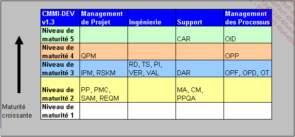

# CMMI

## Définition

**Processus**

> Suite d'action qui transforme des entrées en sorties en y ajoutant une plus-values. Travaillé sur les processus permet d'améliorer la valeur ajouté

Le meilleur moyen d'y arrivé, c'est de METTRE EN ŒUVRE des "OUTILS" permettant d'AMÉLIORER les processus

**Outils**

"Méthodologique" visant à définir les pratiques|processus à mettre en œuvre

__NORMES__: ISO 9001 (Peu de méthodologie, peu spécialisé, directive formelle certifiant l'organisation)
__MÉTHODE__: Agile, PRINCE (Méthode pure, niveau de détail important, certification de personnes)
__RÉFÉRENTIELS__ de bonne pratique (ITIL, CMMI, COBIT). Construit sur le retour d'expérience "qui marche" et reconnues par la communauté.

Méta-Méthode: moins formelle(quoi faire), mais avec un niveau de détail important, très orienté métier. Certification de personne(ITIL) ou d'organisation(CMMI)

Ex:

- ITIL
- CMMI
- PMI
- Méthode agile
- COBIT
- PRINCE
- ISO 9001

**Ingénierie des systèmes Informatiques**

Cycle de vie du SI:

- Besoins
- Études
- Produit/Développement
- Exploitation
- Maintenance

## CMMI-DEV (Capability Maturity Model Integration)

> Modèle intégré d'aptitude et de maturité pour le développement

Modèle: pas une norme, pas une méthode
maturité: Niveau de maturité des processus mis en œuvre. de 1 à 5 :

1. __Initial__: toutes entreprises au départ
2. __Discipliné__: mise en place de la gestion de projet
3. __Ajusté__: Mise en œuvre des processus technique(Engineering), Organisation Entreprise, Industrialise les process
4. __Gérer quantitativement__:  Mise en place d'outils de statistique
5. __En optimisation__: Pilotage par anticipation basé sur des méthodes statistique

Aptitude d'un processus à atteindre ses objectifs de 0 à 4 :

- 0: __Incomplet__
- 1: __Basique__ :atteinte des résultats
- 2: __Discipliné__ :Moyen, procédure, outils... définis.
- 3: __Ajusté__ : Retour d'experience

Utilisateurs:

- DSI
- SS2I
- Editeur

Appartient au S.E.I : Software Engineering Institute (USA, D.O.D)

Dans les années 70: Beaucoup de bugs dans les systèmes, première version CMM(années 80/90) dans les année 2000 les CMM divergent. Retour à un référentiel central (CMMI) et 3 constellation (DEV, SRV, ACQ)

**Pourquoi**

- Améliorer la performance(V.A) des processus
- Assurer la qualité de service/produit
- Améliorer de la satisfaction client
- Augmenter la productivité/éliminer les coûts
- Offrir une garantie "labellisée" de confiance aux clients
- Demande du marché

## Processus

<table style="width:90%">
	<thead>
		<tr>
			<td style="border-color:rgb(0, 0, 0) black black; text-align:center; vertical-align:top">
			
Acronyme

			</td>
			<td style="border-color:rgb(0, 0, 0) black black; text-align:center; vertical-align:top">
			
Domaine de processus

			</td>
			<td style="border-color:rgb(0, 0, 0) black black; text-align:center; vertical-align:top">
			
Cat&eacute;gorie et objet des bonnes pratiques propos&eacute;es par le domaine

			</td>
			<td style="border-color:rgb(0, 0, 0) black black; text-align:center; vertical-align:top">
			
Mod&egrave;le CMMI et niveau de maturit&eacute; auquel appara&icirc;t le domaine

			</td>
		</tr>
	</thead>
	<tbody>
		<tr>
			<td style="border-color:rgb(0, 0, 0) black black; vertical-align:top">
			
<strong>AM</strong>&nbsp;(<em>Agreement Management</em>)

			</td>
			<td style="border-color:rgb(0, 0, 0) black black; vertical-align:top">
			
Gestion de l&rsquo;accord d&rsquo;acquisition

			</td>
			<td style="border-color:rgb(0, 0, 0) black black; vertical-align:top">
			
<strong>Management de projet</strong>&nbsp;: assurer l&rsquo;ex&eacute;cution de l&rsquo;accord par chacune des parties (donneur d&rsquo;ordre et fournisseur).

			</td>
			<td style="border-color:rgb(0, 0, 0) black black; vertical-align:top">
			
ACQ

			
Niveau de maturit&eacute; 2

			</td>
		</tr>
		<tr>
			<td style="border-color:rgb(0, 0, 0) black black; vertical-align:top">
			
<strong>ARD</strong>&nbsp;(<em>Acquisition Requirements Development</em>)

			</td>
			<td style="border-color:rgb(0, 0, 0) black black; vertical-align:top">
			
D&eacute;veloppement des exigences d&rsquo;acquisition

			</td>
			<td style="border-color:rgb(0, 0, 0) black black; vertical-align:top">
			
<strong>Ing&eacute;nierie d&rsquo;acquisition</strong>&nbsp;: identifier et documenter les exigences client et contractuelles.

			</td>
			<td style="border-color:rgb(0, 0, 0) black black; vertical-align:top">
			
ACQ

			
Niveau de maturit&eacute; 2

			</td>
		</tr>
		<tr>
			<td style="border-color:rgb(0, 0, 0) black black; vertical-align:top">
			
<strong>ATM</strong>&nbsp;(<em>Acquisition Technical Management</em>)

			</td>
			<td style="border-color:rgb(0, 0, 0) black black; vertical-align:top">
			
Gestion technique de l&rsquo;acquisition

			</td>
			<td style="border-color:rgb(0, 0, 0) black black; vertical-align:top">
			
<strong>Ing&eacute;nierie d&rsquo;acquisition</strong>&nbsp;: &Eacute;valuer la solution technique du fournisseur et g&eacute;rer les interfaces entre l&rsquo;acquisition et le syst&egrave;me o&ugrave; elle s&rsquo;int&egrave;gre.

			</td>
			<td style="border-color:rgb(0, 0, 0) black black; vertical-align:top">
			
ACQ

			
Niveau de maturit&eacute; 3

			</td>
		</tr>
		<tr>
			<td style="border-color:rgb(0, 0, 0) black black; vertical-align:top">
			
<strong>AVAL</strong>&nbsp;(<em>Acquisition Validation</em>)

			</td>
			<td style="border-color:rgb(0, 0, 0) black black; vertical-align:top">
			
Validation de l&rsquo;acquisition

			</td>
			<td style="border-color:rgb(0, 0, 0) black black; vertical-align:top">
			
<strong>Ing&eacute;nierie d&rsquo;acquisition</strong>&nbsp;: contr&ocirc;ler que l&rsquo;acquisition r&eacute;pond aux besoins op&eacute;rationnels.

			</td>
			<td style="border-color:rgb(0, 0, 0) black black; vertical-align:top">
			
ACQ

			
Niveau de maturit&eacute; 3

			</td>
		</tr>
		<tr>
			<td style="border-color:rgb(0, 0, 0) black black; vertical-align:top">
			
<strong>AVER</strong>&nbsp;(<em>Acquisition Verification</em>)

			</td>
			<td style="border-color:rgb(0, 0, 0) black black; vertical-align:top">
			
V&eacute;rification de l&rsquo;acquisition

			</td>
			<td style="border-color:rgb(0, 0, 0) black black; vertical-align:top">
			
<strong>Ing&eacute;nierie d&rsquo;acquisition</strong>&nbsp;: contr&ocirc;ler que l&rsquo;acquisition est conforme aux exigences.

			</td>
			<td style="border-color:rgb(0, 0, 0) black black; vertical-align:top">
			
ACQ

			
Niveau de maturit&eacute; 3

			</td>
		</tr>
		<tr>
			<td style="border-color:rgb(0, 0, 0) black black; vertical-align:top">
			
<strong>CAM</strong>&nbsp;(<em>Capacity and Availability Management</em>)

			</td>
			<td style="border-color:rgb(0, 0, 0) black black; vertical-align:top">
			
Gestion de la capacit&eacute; et disponibilit&eacute;

			</td>
			<td style="border-color:rgb(0, 0, 0) black black; vertical-align:top">
			
<strong>Management de projet</strong>&nbsp;: assurer la disponibilit&eacute; et la capacit&eacute; n&eacute;cessaires &agrave; r&eacute;pondre aux exigences du service.

			</td>
			<td style="border-color:rgb(0, 0, 0) black black; vertical-align:top">
			
SVC

			
Niveau de maturit&eacute; 3

			</td>
		</tr>
		<tr>
			<td style="border-color:rgb(0, 0, 0) black black; vertical-align:top">
			
<strong>CAR</strong>&nbsp;(<em>Causal Analysis and Resolution</em>)

			</td>
			<td style="border-color:rgb(0, 0, 0) black black; vertical-align:top">
			
Analyse causale et r&eacute;solution

			</td>
			<td style="border-color:rgb(0, 0, 0) black black; vertical-align:top">
			
<strong>Support</strong>&nbsp;: analyse des causes de dysfonctionnement pour y porter rem&egrave;de.

			</td>
			<td style="border-color:rgb(0, 0, 0) black black; vertical-align:top">
			
DEV, SVC, ACQ

			
Niveau de maturit&eacute; 5

			</td>
		</tr>
		<tr>
			<td style="border-color:rgb(0, 0, 0) black black; vertical-align:top">
			
<strong>CM</strong>&nbsp;(<em>Configuration Management</em>)

			</td>
			<td style="border-color:rgb(0, 0, 0) black black; vertical-align:top">
			
Gestion de configuration

			</td>
			<td style="border-color:rgb(0, 0, 0) black black; vertical-align:top">
			
<strong>Support</strong>&nbsp;: ma&icirc;trise des &eacute;volutions apport&eacute;es aux &eacute;l&eacute;ments constitutifs de la configuration de r&eacute;f&eacute;rence.

			</td>
			<td style="border-color:rgb(0, 0, 0) black black; vertical-align:top">
			
DEV, SVC, ACQ

			
Niveau de maturit&eacute; 2

			</td>
		</tr>
		<tr>
			<td style="border-color:rgb(0, 0, 0) black black; vertical-align:top">
			
<strong>DAR</strong>&nbsp;(<em>Decision Analysis and Resolution</em>)

			</td>
			<td style="border-color:rgb(0, 0, 0) black black; vertical-align:top">
			
Analyse et prise de d&eacute;cision

			</td>
			<td style="border-color:rgb(0, 0, 0) black black; vertical-align:top">
			
<strong>Support</strong>&nbsp;: aide &agrave; la prise de d&eacute;cision importante.

			</td>
			<td style="border-color:rgb(0, 0, 0) black black; vertical-align:top">
			
DEV, SVC, ACQ

			
Niveau de maturit&eacute; 3

			</td>
		</tr>
		<tr>
			<td style="border-color:rgb(0, 0, 0) black black; vertical-align:top">
			
<strong>IPM</strong>&nbsp;(<em>Integrated Project Management</em>)

			</td>
			<td style="border-color:rgb(0, 0, 0) black black; vertical-align:top">
			
Gestion de projet int&eacute;gr&eacute;

			</td>
			<td style="border-color:rgb(0, 0, 0) black black; vertical-align:top">
			
<strong>Management de projet</strong>&nbsp;: application des processus standard et renforcement de la coordination entre les parties prenantes au projet.

			</td>
			<td style="border-color:rgb(0, 0, 0) black black; vertical-align:top">
			
DEV, SVC, ACQ

			
Niveau de maturit&eacute; 3

			</td>
		</tr>
		<tr>
			<td style="border-color:rgb(0, 0, 0) black black; vertical-align:top">
			
<strong>IRP</strong>&nbsp;(<em>Incident Resolution and Prevention</em>)

			</td>
			<td style="border-color:rgb(0, 0, 0) black black; vertical-align:top">
			
Pr&eacute;vention et r&eacute;solution des incidents

			</td>
			<td style="border-color:rgb(0, 0, 0) black black; vertical-align:top">
			
<strong>&Eacute;tablissement et fourniture du service</strong>&nbsp;: pr&eacute;venir et r&eacute;soudre les incidents de service.

			</td>
			<td style="border-color:rgb(0, 0, 0) black black; vertical-align:top">
			
SVC

			
Niveau de maturit&eacute; 3

			</td>
		</tr>
		<tr>
			<td style="border-color:rgb(0, 0, 0) black black; vertical-align:top">
			
<strong>MA</strong>&nbsp;(<em>Measurement and Analysis</em>)

			</td>
			<td style="border-color:rgb(0, 0, 0) black black; vertical-align:top">
			
Mesure et analyse

			</td>
			<td style="border-color:rgb(0, 0, 0) black black; vertical-align:top">
			
<strong>Support</strong>&nbsp;: fournir des indicateurs r&eacute;pondant aux besoins d&rsquo;information.

			</td>
			<td style="border-color:rgb(0, 0, 0) black black; vertical-align:top">
			
DEV, SVC, ACQ

			
Niveau de maturit&eacute; 2

			</td>
		</tr>
		<tr>
			<td style="border-color:rgb(0, 0, 0) black black; vertical-align:top">
			
<strong>OPD</strong>&nbsp;(<em>Organisational Process Definition</em>)

			</td>
			<td style="border-color:rgb(0, 0, 0) black black; vertical-align:top">
			
D&eacute;finition du processus organisationnel

			</td>
			<td style="border-color:rgb(0, 0, 0) black black; vertical-align:top">
			
<strong>Management des processus</strong>&nbsp;: documenter les processus standard de l&rsquo;organisation.

			</td>
			<td style="border-color:rgb(0, 0, 0) black black; vertical-align:top">
			
DEV, SVC, ACQ

			
Niveau de maturit&eacute; 3

			</td>
		</tr>
		<tr>
			<td style="border-color:rgb(0, 0, 0) black black; vertical-align:top">
			
<strong>OPF</strong>&nbsp;(<em>Organisational Process Focus</em>)

			</td>
			<td style="border-color:rgb(0, 0, 0) black black; vertical-align:top">
			
Focalisation sur le processus organisationnel

			</td>
			<td style="border-color:rgb(0, 0, 0) black black; vertical-align:top">
			
<strong>Management des processus</strong>&nbsp;: mettre en place une boucle d&rsquo;am&eacute;lioration continue corrigeant les faiblesses constat&eacute;es.

			</td>
			<td style="border-color:rgb(0, 0, 0) black black; vertical-align:top">
			
DEV, SVC, ACQ

			
Niveau de maturit&eacute; 3

			</td>
		</tr>
		<tr>
			<td style="border-color:rgb(0, 0, 0) black black; vertical-align:top">
			
<strong>OPP</strong>&nbsp;(<em>Organisational Process Performance</em>)

			</td>
			<td style="border-color:rgb(0, 0, 0) black black; vertical-align:top">
			
Performance du processus organisationnel

			</td>
			<td style="border-color:rgb(0, 0, 0) black black; vertical-align:top">
			
<strong>Management des processus</strong>&nbsp;: conna&icirc;tre la performance des processus standard de l&rsquo;organisation.

			</td>
			<td style="border-color:rgb(0, 0, 0) black black; vertical-align:top">
			
DEV, SVC, ACQ

			
Niveau de maturit&eacute; 4

			</td>
		</tr>
		<tr>
			<td style="border-color:rgb(0, 0, 0) black black; vertical-align:top">
			
<strong>OPM</strong>&nbsp;(<em>Organisational Process Management</em>)

			</td>
			<td style="border-color:rgb(0, 0, 0) black black; vertical-align:top">
			
Gestion du processus organisationnel

			</td>
			<td style="border-color:rgb(0, 0, 0) black black; vertical-align:top">
			
<strong>Management des processus</strong>&nbsp;: aligner en permanence la performance des processus standard de l&rsquo;organisation avec ses besoins business.

			</td>
			<td style="border-color:rgb(0, 0, 0) black black; vertical-align:top">
			
DEV, SVC, ACQ

			
Niveau de maturit&eacute; 5

			</td>
		</tr>
		<tr>
			<td style="border-color:rgb(0, 0, 0) black black; vertical-align:top">
			
<strong>OT</strong>&nbsp;(<em>Organisational Training</em>)

			</td>
			<td style="border-color:rgb(0, 0, 0) black black; vertical-align:top">
			
Formation organisationnelle

			</td>
			<td style="border-color:rgb(0, 0, 0) black black; vertical-align:top">
			
<strong>Management des processus</strong>&nbsp;: assurer la disponibilit&eacute; des comp&eacute;tences n&eacute;cessaires &agrave; l&rsquo;organisation.

			</td>
			<td style="border-color:rgb(0, 0, 0) black black; vertical-align:top">
			
DEV, SVC, ACQ

			
Niveau de maturit&eacute; 3

			</td>
		</tr>
		<tr>
			<td style="border-color:rgb(0, 0, 0) black black; vertical-align:top">
			
<strong>PI</strong>&nbsp;(<em>Product Integration</em>)

			</td>
			<td style="border-color:rgb(0, 0, 0) black black; vertical-align:top">
			
Int&eacute;gration de produit

			</td>
			<td style="border-color:rgb(0, 0, 0) black black; vertical-align:top">
			
<strong>Ing&eacute;nierie</strong>&nbsp;: assembler et livrer le produit.

			</td>
			<td style="border-color:rgb(0, 0, 0) black black; vertical-align:top">
			
DEV

			
Niveau de maturit&eacute; 3

			</td>
		</tr>
		<tr>
			<td style="border-color:rgb(0, 0, 0) black black; vertical-align:top">
			
<strong>PMC</strong>&nbsp;(<em>Project Monitoring and Control</em>)

			</td>
			<td style="border-color:rgb(0, 0, 0) black black; vertical-align:top">
			
Surveillance et contr&ocirc;le de projet

			</td>
			<td style="border-color:rgb(0, 0, 0) black black; vertical-align:top">
			
<strong>Management de projet</strong>&nbsp;: suivre l&rsquo;avancement du projet par rapport au plan et corriger les &eacute;carts significatifs.

			</td>
			<td style="border-color:rgb(0, 0, 0) black black; vertical-align:top">
			
DEV, SVC, ACQ

			
Niveau de maturit&eacute; 2

			</td>
		</tr>
		<tr>
			<td style="border-color:rgb(0, 0, 0) black black; vertical-align:top">
			
<strong>PP</strong>&nbsp;(<em>Project Planning</em>)

			</td>
			<td style="border-color:rgb(0, 0, 0) black black; vertical-align:top">
			
Planification de projet

			</td>
			<td style="border-color:rgb(0, 0, 0) black black; vertical-align:top">
			
<strong>Management de projet</strong>&nbsp;: &eacute;tablir un plan de projet.

			</td>
			<td style="border-color:rgb(0, 0, 0) black black; vertical-align:top">
			
DEV, SVC, ACQ

			
Niveau de maturit&eacute; 2

			</td>
		</tr>
		<tr>
			<td style="border-color:rgb(0, 0, 0) black black; vertical-align:top">
			
<strong>PPQA</strong>&nbsp;(<em>Process and Product Quality Assurance</em>)

			</td>
			<td style="border-color:rgb(0, 0, 0) black black; vertical-align:top">
			
Assurance Qualit&eacute; Processus et Produit

			</td>
			<td style="border-color:rgb(0, 0, 0) black black; vertical-align:top">
			
<strong>Support</strong>&nbsp;: Identifier et s&rsquo;assurer de la correction des non-conformit&eacute;s processus et produit.

			</td>
			<td style="border-color:rgb(0, 0, 0) black black; vertical-align:top">
			
DEV, SVC, ACQ

			
Niveau de maturit&eacute; 2

			</td>
		</tr>
		<tr>
			<td style="border-color:rgb(0, 0, 0) black black; vertical-align:top">
			
<strong>QPM</strong>&nbsp;(<em>Quantitative Project Management</em>)

			</td>
			<td style="border-color:rgb(0, 0, 0) black black; vertical-align:top">
			
Gestion de Projet quantitative

			</td>
			<td style="border-color:rgb(0, 0, 0) black black; vertical-align:top">
			
<strong>Management de projet</strong>&nbsp;: g&eacute;rer le projet en utilisant des techniques quantitatives.

			</td>
			<td style="border-color:rgb(0, 0, 0) black black; vertical-align:top">
			
DEV, SVC, ACQ

			
Niveau de maturit&eacute; 4

			</td>
		</tr>
		<tr>
			<td style="border-color:rgb(0, 0, 0) black black; vertical-align:top">
			
<strong>RD</strong>&nbsp;(<em>Requirements Development</em>)

			</td>
			<td style="border-color:rgb(0, 0, 0) black black; vertical-align:top">
			
D&eacute;veloppement des exigences

			</td>
			<td style="border-color:rgb(0, 0, 0) black black; vertical-align:top">
			
<strong>Ing&eacute;nierie</strong>&nbsp;: identifier et documenter les exigences du produit.

			</td>
			<td style="border-color:rgb(0, 0, 0) black black; vertical-align:top">
			
DEV

			
Niveau de maturit&eacute; 3

			</td>
		</tr>
		<tr>
			<td style="border-color:rgb(0, 0, 0) black black; vertical-align:top">
			
<strong>REQM</strong>&nbsp;(<em>Requirements Management</em>)

			</td>
			<td style="border-color:rgb(0, 0, 0) black black; vertical-align:top">
			
Gestion des exigences

			</td>
			<td style="border-color:rgb(0, 0, 0) black black; vertical-align:top">
			
<strong>Management de projet</strong>&nbsp;: g&eacute;rer les &eacute;volutions des exigences.

			</td>
			<td style="border-color:rgb(0, 0, 0) black black; vertical-align:top">
			
DEV, SVC, ACQ

			
Niveau de maturit&eacute; 2

			</td>
		</tr>
		<tr>
			<td style="border-color:rgb(0, 0, 0) black black; vertical-align:top">
			
<strong>RSKM</strong>&nbsp;(<em>Risk Management</em>)

			</td>
			<td style="border-color:rgb(0, 0, 0) black black; vertical-align:top">
			
Gestion des risques

			</td>
			<td style="border-color:rgb(0, 0, 0) black black; vertical-align:top">
			
<strong>Management de projet</strong>&nbsp;: identifier et r&eacute;duire les risques produit et/ou projet en suivant une strat&eacute;gie organisationnelle.

			</td>
			<td style="border-color:rgb(0, 0, 0) black black; vertical-align:top">
			
DEV, SVC, ACQ

			
Niveau de maturit&eacute; 3

			</td>
		</tr>
		<tr>
			<td style="border-color:rgb(0, 0, 0) black black; vertical-align:top">
			
<strong>SAM</strong>&nbsp;(<em>Supplier Agreement Management</em>)

			</td>
			<td style="border-color:rgb(0, 0, 0) black black; vertical-align:top">
			
Gestion des accords avec les fournisseurs

			</td>
			<td style="border-color:rgb(0, 0, 0) black black; vertical-align:top">
			
<strong>Management de projet</strong>&nbsp;: s&eacute;lectionner les fournisseurs, passer et ex&eacute;cuter l&rsquo;accord.

			</td>
			<td style="border-color:rgb(0, 0, 0) black black; vertical-align:top">
			
DEV, SVC

			
Niveau de maturit&eacute; 2

			</td>
		</tr>
		<tr>
			<td style="border-color:rgb(0, 0, 0) black black; vertical-align:top">
			
<strong>SC</strong>&nbsp;(<em>Service Continuity</em>)

			</td>
			<td style="border-color:rgb(0, 0, 0) black black; vertical-align:top">
			
Continuit&eacute; de service

			</td>
			<td style="border-color:rgb(0, 0, 0) black black; vertical-align:top">
			
<strong>&Eacute;tablissement et fourniture du service</strong>&nbsp;: documenter et appliquer les plans des activit&eacute;s n&eacute;cessaires &agrave; assurer la continuit&eacute; de service.

			</td>
			<td style="border-color:rgb(0, 0, 0) black black; vertical-align:top">
			
SVC

			
Niveau de maturit&eacute; 3

			</td>
		</tr>
		<tr>
			<td style="border-color:rgb(0, 0, 0) black black; vertical-align:top">
			
<strong>SD</strong>&nbsp;(<em>Service Delivery</em>)

			</td>
			<td style="border-color:rgb(0, 0, 0) black black; vertical-align:top">
			
Fourniture du service

			</td>
			<td style="border-color:rgb(0, 0, 0) black black; vertical-align:top">
			
<strong>&Eacute;tablissement et fourniture du service</strong>&nbsp;: fournir les services conform&eacute;ment aux accords de service.

			</td>
			<td style="border-color:rgb(0, 0, 0) black black; vertical-align:top">
			
SVC

			
Niveau de maturit&eacute; 2

			</td>
		</tr>
		<tr>
			<td style="border-color:rgb(0, 0, 0) black black; vertical-align:top">
			
<strong>SSAD</strong>&nbsp;(<em>Solicitation and Supplier Agreement Development</em>)

			</td>
			<td style="border-color:rgb(0, 0, 0) black black; vertical-align:top">
			
D&eacute;veloppement du dossier de consultation des fournisseurs et de l&rsquo;accord fournisseur

			</td>
			<td style="border-color:rgb(0, 0, 0) black black; vertical-align:top">
			
<strong>Management de projet</strong>&nbsp;: pr&eacute;parer un dossier de consultation de fournisseurs, s&eacute;lectionner le ou les fournisseurs et documenter l&rsquo;accord fournisseur.

			</td>
			<td style="border-color:rgb(0, 0, 0) black black; vertical-align:top">
			
ACQ

			
Niveau de maturit&eacute; 2

			</td>
		</tr>
		<tr>
			<td style="border-color:rgb(0, 0, 0) black black; vertical-align:top">
			
<strong>SSD</strong>&nbsp;(<em>Service System Development</em>)

			</td>
			<td style="border-color:rgb(0, 0, 0) black black; vertical-align:top">
			
D&eacute;veloppement du syst&egrave;me n&eacute;cessaire au service

			</td>
			<td style="border-color:rgb(0, 0, 0) black black; vertical-align:top">
			
<strong>&Eacute;tablissement et fourniture du service</strong>&nbsp;: concevoir et mettre en place un syst&egrave;me pour satisfaire aux besoins des accords de service.

			</td>
			<td style="border-color:rgb(0, 0, 0) black black; vertical-align:top">
			
SVC

			
Niveau de maturit&eacute; 3

			</td>
		</tr>
		<tr>
			<td style="border-color:rgb(0, 0, 0) black black; vertical-align:top">
			
<strong>SSM</strong>&nbsp;(<em>Service System Management</em>)

			</td>
			<td style="border-color:rgb(0, 0, 0) black black; vertical-align:top">
			
Gestion du syst&egrave;me n&eacute;cessaire au service

			</td>
			<td style="border-color:rgb(0, 0, 0) black black; vertical-align:top">
			
<strong>&Eacute;tablissement et fourniture du service</strong>&nbsp;: mettre en place des services standard align&eacute;s sur les besoins et plans strat&eacute;giques.

			</td>
			<td style="border-color:rgb(0, 0, 0) black black; vertical-align:top">
			
SVC

			
Niveau de maturit&eacute; 3

			</td>
		</tr>
		<tr>
			<td style="border-color:rgb(0, 0, 0) black black; vertical-align:top">
			
<strong>SST</strong>&nbsp;(<em>Service System Transition</em>)

			</td>
			<td style="border-color:rgb(0, 0, 0) black black; vertical-align:top">
			
Transition du syst&egrave;me n&eacute;cessaire au service

			</td>
			<td style="border-color:rgb(0, 0, 0) black black; vertical-align:top">
			
<strong>&Eacute;tablissement et fourniture du service</strong>&nbsp;: d&eacute;ployer des &eacute;volutions de composants du syst&egrave;me n&eacute;cessaire au service tout en pr&eacute;servant la fourniture op&eacute;rationnelle du service.

			</td>
			<td style="border-color:rgb(0, 0, 0) black black; vertical-align:top">
			
SVC

			
Niveau de maturit&eacute; 3

			</td>
		</tr>
		<tr>
			<td style="border-color:rgb(0, 0, 0) black black; vertical-align:top">
			
<strong>TS</strong>&nbsp;(<em>Technical Solution</em>)

			</td>
			<td style="border-color:rgb(0, 0, 0) black black; vertical-align:top">
			
Solution technique

			</td>
			<td style="border-color:rgb(0, 0, 0) black black; vertical-align:top">
			
<strong>Ing&eacute;nierie</strong>&nbsp;: Identifier, concevoir et r&eacute;aliser une solution technique en r&eacute;ponse aux exigences.

			</td>
			<td style="border-color:rgb(0, 0, 0) black black; vertical-align:top">
			
DEV

			
Niveau de maturit&eacute; 3

			</td>
		</tr>
		<tr>
			<td style="border-color:rgb(0, 0, 0) black black; vertical-align:top">
			
<strong>VAL</strong>&nbsp;(<em>Validation</em>)

			</td>
			<td style="border-color:rgb(0, 0, 0) black black; vertical-align:top">
			
Validation

			</td>
			<td style="border-color:rgb(0, 0, 0) black black; vertical-align:top">
			
<strong>Ing&eacute;nierie</strong>&nbsp;: contr&ocirc;ler que le produit r&eacute;pond aux besoins op&eacute;rationnels.

			</td>
			<td style="border-color:rgb(0, 0, 0) black black; vertical-align:top">
			
DEV

			
Niveau de maturit&eacute; 3

			</td>
		</tr>
		<tr>
			<td style="border-color:rgb(0, 0, 0) black black; vertical-align:top">
			
<strong>VER</strong>&nbsp;(<em>V&eacute;rification</em>)

			</td>
			<td style="border-color:rgb(0, 0, 0) black black; vertical-align:top">
			
V&eacute;rification

			</td>
			<td style="border-color:rgb(0, 0, 0) black black; vertical-align:top">
			
<strong>Ing&eacute;nierie</strong>&nbsp;: contr&ocirc;ler que le produit est conforme aux exigences.

			</td>
			<td style="border-color:rgb(0, 0, 0) black black; vertical-align:top">
			
DEV

			
Niveau de maturit&eacute; 3

			
&nbsp;

			</td>
		</tr>
	</tbody>
</table>

### Description d'un processus

1. Intention(Définition)
2. liens avec les autres processus
3. Produit d'activité(Paramétres de sorties)
4. Pratiques (Liste de sous-processus)
  - Pratiques "Generique" valable pour plusieurs processus
  - Pratiques "Specifique" lié à un processus
  - Sous-pratique
5. Objectifs
  - Objectifs "Generique" valable pour plusieurs processus
  - Objectifs "Specifique" lié à un processus
6. Exemples
7. Remarques

## Evaluation CMMI

Passage N1 à N2
Exigence: Mettre en oeuvre 7 domaine de processus (PP/PMC,SAM,MA,PPQA,CM,REQM)

Evaluation sur l'entreprise:
- Un budget
- Un évaluateur certifié par S.E.I

## Mise en oeuvre

1. Mode "Projet d'amelioration"
2. Planification

# Quelques reponse aux Questions

Maturité: Niveau de mise en oeuvre des processus
Etude n'est pas une categorie de processus
22 processus
Mise en oeuvre du niveau 1 à Niveau 2 : 18 à 24 mois
Processus de gestion des exigence fait partie de la categorie ingénierie
CMMI est maintenu par SEI
